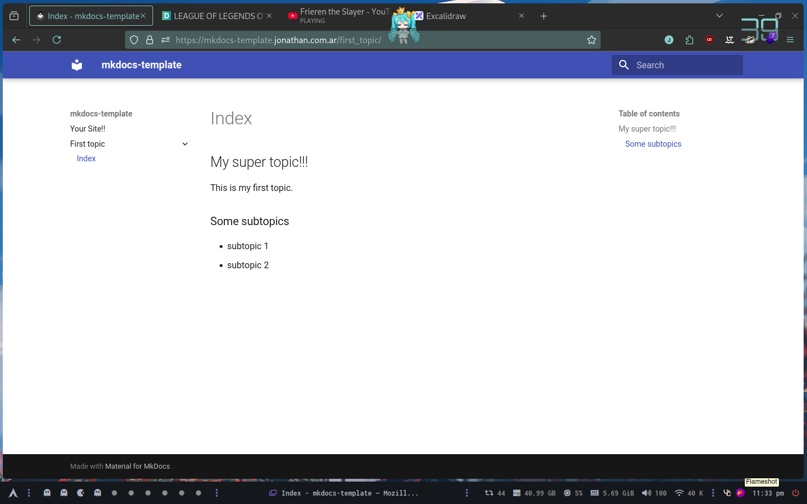
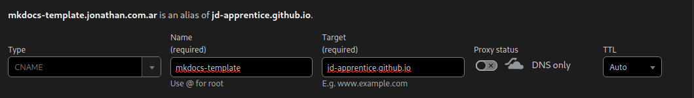
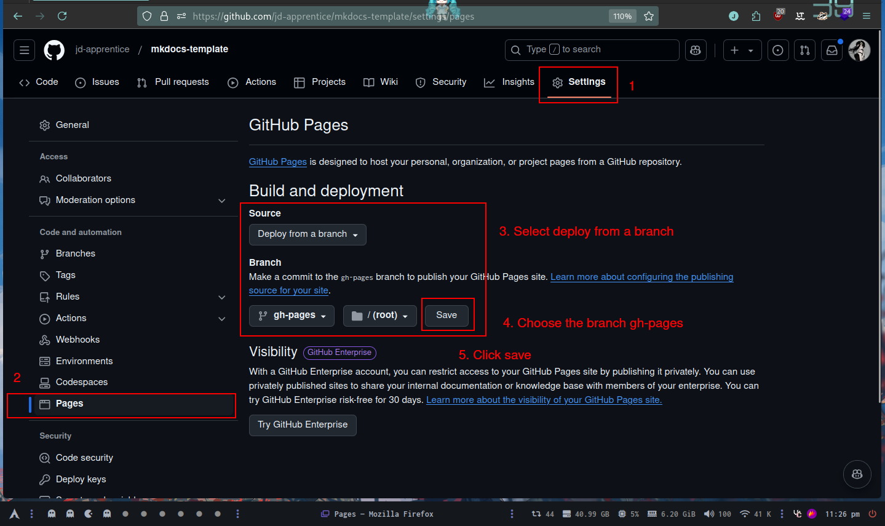
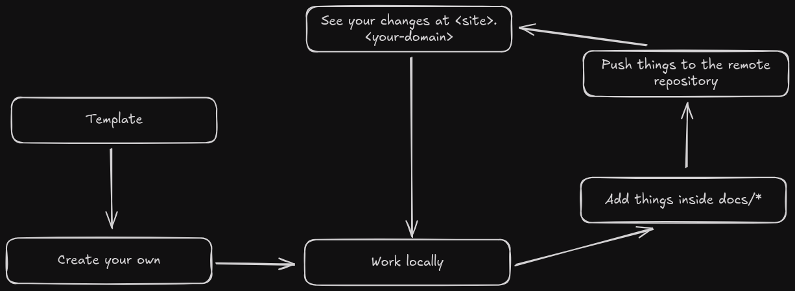

# MKDocs Starter

Template to startup a documentation site with mkdocs



## Contains

- base setup
- [github-actions](https://github.com/peaceiris/actions-gh-pages/tree/v4/)
- [mkdocs-material](https://squidfunk.github.io/mkdocs-material/)

## Configuration

Change the `site_name` in `mkdocs.yml`

### Not using a custom domain

If you don't have a domain, remove the property the `cname` in `.github/workflows/ci.yml`

### Using a custom domain

Change the `cname` in `.github/workflows/ci.yml`

In case you are using a custom domain you must create the CNAME in your DNS resolver



You point the CNAME (the one we are using at .github/workflows/ci.yml) to your github.io page which is normally `<username>.github.io`

### Enable GitHub Pages

After the first push, a branch with the name of `gh-pages` will be created, now we do the following



### Theme

If you don't want to use material theme, change the `theme` in `mkdocs.yml` and `.github/workflows/ci.yml`
You can read more about it [HERE](https://www.mkdocs.org/user-guide/choosing-your-theme/)

## Workflow



```shell
🌳 mkdocs-template/
┣ 📁 .github/
┃ ┗ 📁 workflows/
┃   ┗ 📄 ci.yml
┣ 📁 docs/ -- Create your docs here
┃ ┗ 📄 index.md
┣ 📄 LICENSE
┣ 📄 README.md
┗ 📄 mkdocs.yml
```